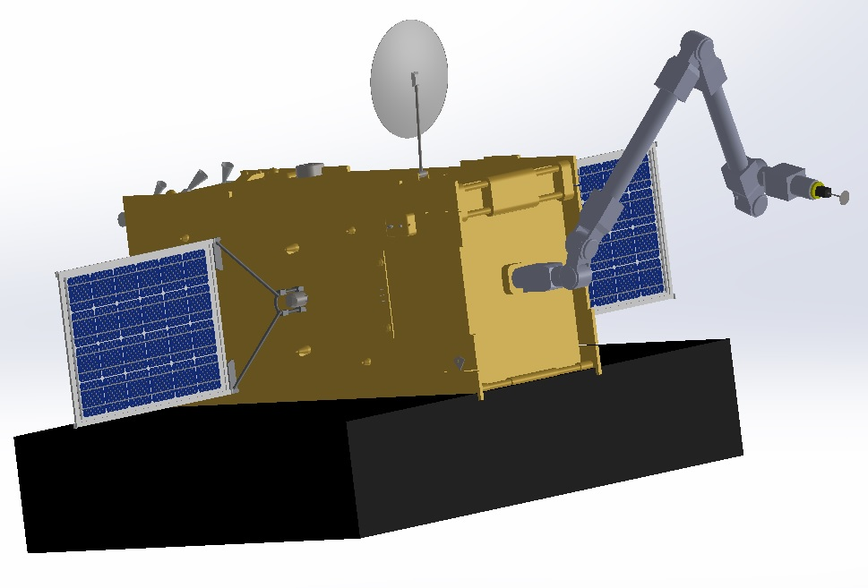
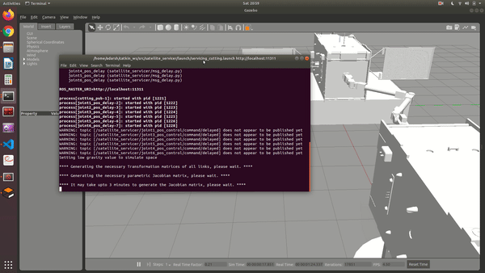
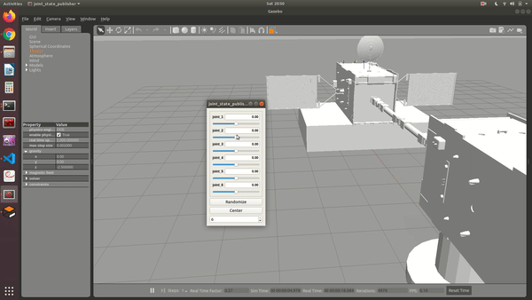

# Modeling and Simulation of Satellite Servicing Manipulators

Final Project for the course _ENPM662: Introduction to Robot Modeling (Fall 2021)_.

This project was inspired based on my work in Johns Hopkins as a visiting intern at the Laboratory for Computational Sensing and Robotics working on the NASA research project for Restore-L. The aim was to simulate the European Robotic Arm (ERA) in an outer space like environment using ROS and Gazebo. The CAD model for the satellite was taken from [GrabCAD](https://grabcad.com/library/satellite-turksat-5a-1) and modified to suit our requirements. All credits go to the respective author of the satellite CAD model.

### Demo of the _servicing_ manipulator cutting through the surface of the _broken_ satellite

### Demo of the _servicing_ manipulator being controlled through teleoperation (with time-delay)

